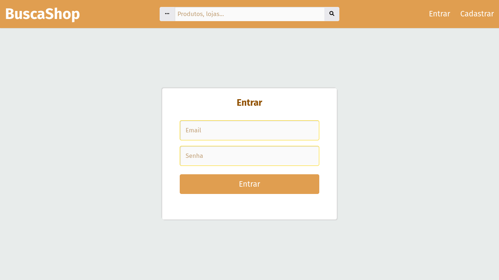
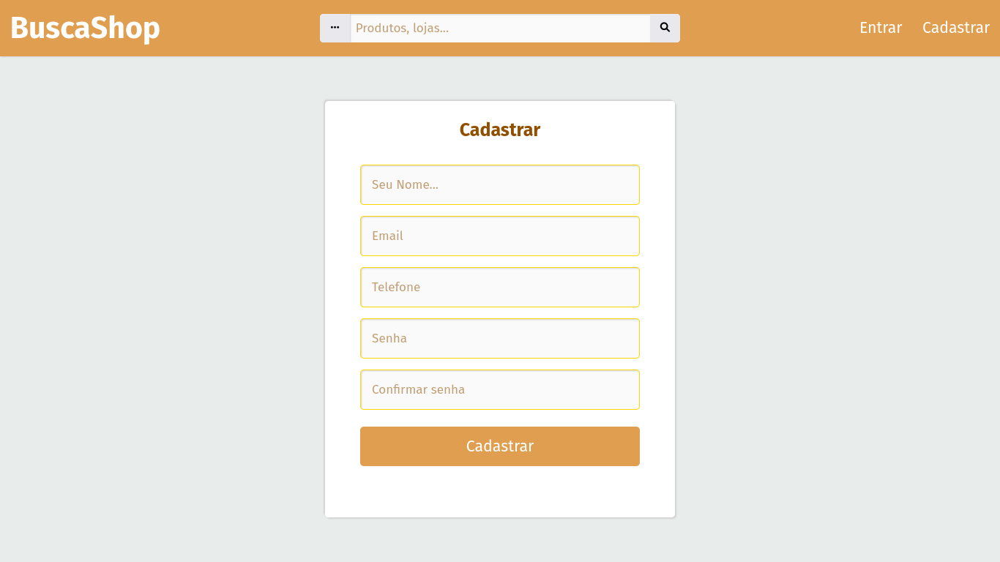
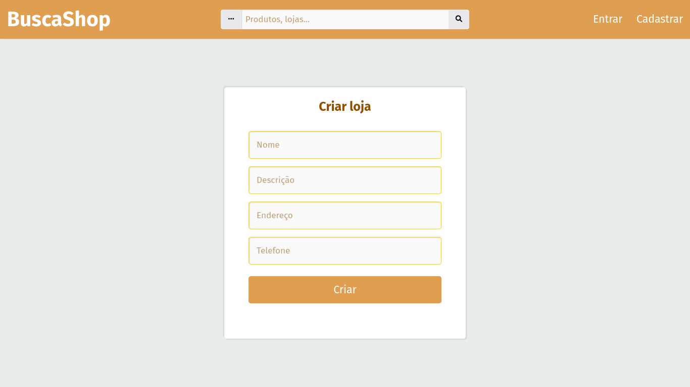

# BuscaShop - Assistente de compras
Este projeto é resultado de um exercício de gerenciamento de projetos,
feito no decorrer da disciplina de Sistemas de Inovação e Empreendedorismo,
do cusrso de ciência da computação da UFOPA.

## Teste
<code>php -S localhost:XXXX</code>
ou usando um servidor web.

# Capturas de tela
## Página de <i>login</i>

## Página de cadastro

## Página de criação de loja

